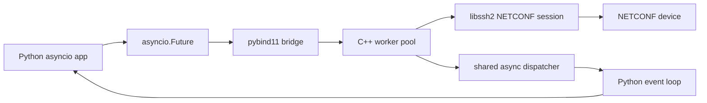
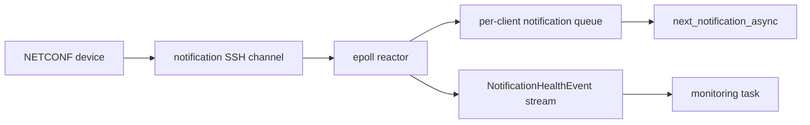

<div align="center">

# pyNetX

### Async-first NETCONF automation for Python

**pyNetX** is a production-grade, high-performance Python library for building NETCONF clients, automation scripts, and network applications at scale. It combines a clean Python API with a C++/pybind11 core, non-blocking libssh2 I/O, asyncio-friendly futures, epoll-backed notification reactors, and production-focused notification observability.

Designed for demanding network automation workloads, pyNetX has been battle-tested with **1,000+ real devices in a single instance** under high load, high throughput, and strict resource constraints.

<br />

[](https://pypi.org/project/pyNetX/)
[](#requirements)
[](#v205--latest)
[](#why-pynetx)

<br />


### 👉 [Open the interactive pyNetX website](https://jackofsometrades99.github.io/pynetx-website/)

<br />

The website is the easiest way to understand how pyNetX works. It shows the async flow, notification reactor, event stream, worker pool, and latest v2.0.5 architecture visually with interactive 3D-style illustrations.

<br />

**Website:** https://jackofsometrades99.github.io/pynetx-website/  
**Docs:** https://pynetx.readthedocs.io/en/latest/  
**PyPI:** https://pypi.org/project/pyNetX/  
**GitHub:** https://github.com/jackofsometrades99/pyNetX

</div>

---

## Why pyNetX?

pyNetX is built for users who need more than a simple blocking NETCONF script. It is designed for async applications, large notification workloads, and safer production automation.

| Capability | What it gives you |
|---|---|
| **Async-first NETCONF API** | Use `await client.connect_async()`, `await client.get_config_async()`, and other asyncio-friendly methods. |
| **C++ core with pybind11** | NETCONF work runs in a native backend while exposing a clean Python interface. |
| **Shared worker pool** | Async NETCONF operations are submitted to a configurable C++ thread pool. |
| **Shared async dispatcher** | Python `asyncio.Future` objects are completed safely on the event-loop thread. |
| **epoll notification reactor** | Notification sockets are monitored by background reactor threads instead of one Python thread per device. |
| **Notification health event stream** | v2.0.5 adds process-wide health events for queue pressure, drops, recovery, and malformed/incomplete notifications. |
| **Safer bad-device handling** | Incomplete notification guards prevent a bad device from trapping the reactor forever. |

---

## Install

```bash
pip install pyNetX==2.0.5
```

Or install the latest available version:

```bash
pip install pyNetX
```

### Requirements

- Python **3.11+**
- Build dependencies: `setuptools`, `wheel`, `cmake`, `scikit-build`, `pybind11`
- System libraries: `libxml2`, `libxslt`, `libssh2`, `tinyxml2`

On Debian/Ubuntu:

```bash
sudo apt-get install libxml2-dev libxslt1-dev libssh2-dev tinyxml2-dev audit
```

---

## Quick start: async NETCONF RPCs

```python
import asyncio
import pyNetX

async def main():
    client = pyNetX.NetconfClient(
        hostname="192.168.1.1",
        port=830,
        username="admin",
        password="admin",
        connect_timeout=30,
        read_timeout=30,
        socket_connect_timeout=5,
        notif_queue_size=1000,
        notif_incomplete_max_kb=1024,
        notif_incomplete_timeout=5,
        notif_drop_event_threshold=1,
    )

    await client.connect_async()

    config = await client.get_config_async(source="running")
    print(config)

    await client.disconnect_async()

asyncio.run(main())
```

---

## Quick start: notifications with async queue reads

```python
import asyncio
import pyNetX

async def consume_notifications():
    client = pyNetX.NetconfClient(
        hostname="192.168.1.1",
        port=830,
        username="admin",
        password="admin",
        notif_queue_size=1000,
        notif_incomplete_max_kb=1024,
        notif_incomplete_timeout=5,
        notif_drop_event_threshold=1,
    )

    await client.connect_async()
    await client.subscribe_async(stream="NETCONF")

    while client.is_subscription_active():
        notification = await client.next_notification_async(timeout_ms=1000)
        if notification:
            print("Notification:", notification)

asyncio.run(consume_notifications())
```

`next_notification_async()` is new in **v2.0.5**. It is the awaitable version of `next_notification(timeout_ms=10)`.

---

## Quick start: notification health event stream

pyNetX **v2.0.5** adds a process-wide event stream for notification system health.

Use it to observe:

- bounded notification queues becoming full,
- notification drops,
- queue recovery,
- incomplete or malformed notification reads,
- health-event drops if the event bus itself becomes full.

```python
import asyncio
import pyNetX

async def monitor_notification_health():
    while True:
        event = await pyNetX.next_notification_event_async(timeout_ms=-1)
        if event.valid:
            print(event.as_dict())

asyncio.run(monitor_notification_health())
```

Common event types:

| Event type | Meaning |
|---|---|
| `notification_queue_full` | A bounded per-client notification queue first became full and a notification was dropped. |
| `notification_drops_summary` | Additional notifications were dropped while the queue remained full. Frequency is controlled by `notif_drop_event_threshold`. |
| `notification_queue_recovered` | A previously full queue has free capacity again. |
| `incomplete_notification` | Partial notification data was received without the NETCONF `]]>]]>` EOM marker and an incomplete-notification guard fired. |
| `timeout` | No health event was available before the requested timeout. This event has `valid == False`. |

---

## What changed in v2.0.5?

### v2.0.5 — latest

The **2.0.5** release focuses on notification observability, safer reactor behavior, and making pyNetX more clearly async-first.

| New in v2.0.5 | Description |
|---|---|
| `NotificationHealthEvent` | Structured health event object with fields and `as_dict()`. |
| `pyNetX.next_notification_event()` | Synchronous helper for reading the process-wide notification health event stream. |
| `pyNetX.next_notification_event_async()` | Awaitable health event stream API. |
| `pyNetX.pending_notification_event_count()` | Returns queued health-event count. |
| `pyNetX.clear_notification_events()` | Clears queued health events and resets the dropped-health-event counter. |
| `client.next_notification_async()` | Awaitable notification queue read API. |
| GIL release in `next_notification()` | The synchronous notification queue helper releases the Python GIL while waiting. |
| `notif_incomplete_max_kb` | Size guard for incomplete notification XML. |
| `notif_incomplete_timeout` | Time guard for partial notifications that never receive EOM. |
| `notif_drop_event_threshold` | Controls how often queue-full drop events are emitted. Default: `1`. |
| Sync-flow deprecation warning | Explicit sync-flow APIs are deprecated; async methods are the preferred path. |

---

## Architecture at a glance



Async NETCONF calls are submitted to a shared C++ worker pool. The result is bridged back into Python as an `asyncio.Future`, and completion is scheduled safely on the Python event loop.

Notification handling uses a separate reactor path:



The website shows these flows visually with interactive architecture illustrations:  
**https://jackofsometrades99.github.io/pynetx-website/**

---

## Constructor reference

```python
client = pyNetX.NetconfClient(
    hostname="192.168.1.1",
    port=830,
    username="admin",
    password="admin",
    key_path="",
    connect_timeout=60,
    read_timeout=60,
    notif_queue_size=-1,
    socket_connect_timeout=5,
    notif_incomplete_max_kb=1024,
    notif_incomplete_timeout=5,
    notif_drop_event_threshold=1,
)
```

| Parameter | Default | Description |
|---|---:|---|
| `hostname` | required | NETCONF device hostname or IP address. |
| `port` | `830` | NETCONF SSH port. |
| `username` | required | SSH username. |
| `password` | required | SSH password. |
| `key_path` | `""` | Reserved for key-based authentication. Current authentication path uses password auth. |
| `connect_timeout` | `60` | Overall timeout for connection/session setup. |
| `read_timeout` | `60` | Timeout while waiting for device RPC replies or NETCONF messages. Use a negative value to wait indefinitely. |
| `notif_queue_size` | `-1` | Per-client notification queue size. `-1` means unbounded. Non-negative values bound the queue. |
| `socket_connect_timeout` | `5` | TCP socket connection timeout. Must be greater than `0` and less than or equal to `connect_timeout`. |
| `notif_incomplete_max_kb` | `1024` | Maximum partial notification size, in KiB, before pyNetX returns the partial notification and emits a health event. Use `-1` to disable this guard. |
| `notif_incomplete_timeout` | `5` | Maximum time, in seconds, to wait for a notification EOM marker after partial data starts arriving. Use `-1` to disable this guard. |
| `notif_drop_event_threshold` | `1` | Number of additional queue-full drops before another queue-full health event is emitted. Must be greater than `0`. |

Use keyword arguments when constructing clients. This avoids positional-order confusion and makes new release parameters safer to adopt.

At least one incomplete-notification guard must remain enabled. Do not set both `notif_incomplete_max_kb=-1` and `notif_incomplete_timeout=-1`.

---

## API overview

### Recommended async flow APIs

| Method | Purpose |
|---|---|
| `await client.connect_async()` | Open a NETCONF session. |
| `await client.disconnect_async()` | Close the session. |
| `await client.send_rpc_async(rpc)` | Send a custom NETCONF RPC. |
| `await client.get_async(filter="")` | Run NETCONF `<get>`. |
| `await client.get_config_async(source="running", filter="")` | Read configuration. |
| `await client.copy_config_async(target, source)` | Copy datastore/configuration. |
| `await client.delete_config_async(target)` | Delete datastore. |
| `await client.validate_async(source="running")` | Validate datastore. |
| `await client.edit_config_async(target, config, do_validate=False)` | Edit configuration. |
| `await client.subscribe_async(stream="NETCONF", filter="")` | Create notification subscription. |
| `await client.lock_async(target="running")` | Lock datastore. |
| `await client.unlock_async(target="running")` | Unlock datastore. |
| `await client.commit_async()` | Commit candidate changes where supported. |
| `await client.locked_edit_config_async(target, config, do_validate=False)` | Lock, edit, optionally validate, and unlock. |

### Notification queue helpers

These are **not deprecated**.

| Method | Purpose |
|---|---|
| `client.next_notification(timeout_ms=10)` | Synchronous helper for queued notifications. Releases the GIL while waiting. |
| `await client.next_notification_async(timeout_ms=10)` | Awaitable notification queue read. |
| `client.peek_notifications(max_items=100)` | Inspect queued notifications without consuming them. |
| `client.notification_queue_size()` | Return current notification queue depth. |
| `client.is_subscription_active()` | Check whether the notification subscription is active. |
| `client.delete_subscription()` | Delete the notification subscription/session. |

### Notification health event APIs

| Function | Purpose |
|---|---|
| `pyNetX.next_notification_event(timeout_ms=-1)` | Read next health event synchronously. |
| `await pyNetX.next_notification_event_async(timeout_ms=-1)` | Await next health event. |
| `pyNetX.pending_notification_event_count()` | Count queued health events. |
| `pyNetX.clear_notification_events()` | Clear queued health events and reset dropped counter. |

### Global configuration

| Function | Purpose |
|---|---|
| `pyNetX.set_threadpool_size(n)` | Configure shared NETCONF worker pool size. |
| `pyNetX.set_notification_reactor_count(n)` | Configure background epoll notification reactor count. |

Set these during process startup before active operations.

---

## Deprecation notice: explicit sync-flow APIs

Starting with **v2.0.5**, the explicit synchronous flow APIs are deprecated and will be removed in a future major release. pyNetX is moving toward an async-focused API for connection handling, RPC execution, configuration operations, and subscriptions.

Deprecated methods:

```text
connect_sync
disconnect_sync
send_rpc_sync
receive_notification_sync
get_sync
get_config_sync
copy_config_sync
delete_config_sync
validate_sync
edit_config_sync
subscribe_sync
lock_sync
unlock_sync
commit_sync
locked_edit_config_sync
```

Common/helper APIs are **not** deprecated. This includes `next_notification`, `next_notification_async`, queue inspection, event-stream APIs, `delete_subscription`, `set_threadpool_size`, and `set_notification_reactor_count`.

### Migration example

Before:

```python
client.connect_sync()
reply = client.get_config_sync(source="running")
client.disconnect_sync()
```

After:

```python
await client.connect_async()
reply = await client.get_config_async(source="running")
await client.disconnect_async()
```

---

## Error handling

pyNetX exposes public exception classes for NETCONF-related failures:

```python
from pyNetX import (
    NetconfConnectionRefusedError,
    NetconfAuthError,
    NetconfChannelError,
    NetconfException,
)
```

Example:

```python
try:
    await client.connect_async()
except pyNetX.NetconfConnectionRefusedError:
    print("Device refused the NETCONF connection")
except pyNetX.NetconfAuthError:
    print("Authentication failed")
except pyNetX.NetconfChannelError:
    print("NETCONF channel setup failed")
except pyNetX.NetconfException as exc:
    print("NETCONF error:", exc)
```

Async methods preserve the same public pyNetX exception classes used by the sync API.

---

## Scaling recommendations

### Worker pool

```python
import pyNetX

pyNetX.set_threadpool_size(10)
```

This controls how many NETCONF worker operations can run concurrently across all clients/devices. Operations on the same `NetconfClient` RPC channel remain serialized to preserve request/reply ordering.

### Notification reactor count

```python
import pyNetX

pyNetX.set_notification_reactor_count(8)
```

This controls how many background epoll reactor threads monitor notification sockets. For large deployments, configure this once during startup before creating many subscriptions.

### Event monitor tasks

`next_notification_event_async(timeout_ms=-1)` waits indefinitely and can occupy a worker thread. In production, run a small number of long-lived event monitor tasks and size the worker pool accordingly.

---

## Release history

### v2.0.5 — latest

- Added notification health event stream.
- Added `NotificationHealthEvent` and `event.as_dict()`.
- Added `next_notification_event`, `next_notification_event_async`, `pending_notification_event_count`, and `clear_notification_events`.
- Added `next_notification_async`.
- Added early GIL release in `next_notification` while waiting on the notification queue.
- Added incomplete-notification guards: `notif_incomplete_max_kb` and `notif_incomplete_timeout`.
- Added `notif_drop_event_threshold` for queue-full health event frequency.
- Added queue inspection helpers: `peek_notifications` and `notification_queue_size`.
- Deprecated explicit synchronous flow APIs.

### v2.0.4

- Added user-configurable `socket_connect_timeout`.
- Reduced CPU usage for non-blocking reads by waiting on socket readiness with `poll()`.
- Replaced one watcher thread per async operation with a shared async future dispatcher.
- Async methods now preserve pyNetX custom exception types.

### v2.0.3

- Hardened notification reactor exception handling.
- Registered notification sockets only after subscription RPC success.
- Improved notification cleanup and subscription state safety.
- Added safer weak-reference handling in the notification reactor.

### v2.0.2

- Improved exception handling to prevent Python process crashes.
- Added `notif_queue_size` for internal notification queues.
- Added global release builds for Python 3.11, 3.12, 3.13, and 3.14.

### v1.0.9

- Added cancellation-safe asyncio bridge guard to avoid `InvalidStateError` after Python future cancellation.

### v1.0.8

- Reimplemented notification monitoring with an epoll-based notification subsystem.
- Added `set_notification_reactor_count()`.
- Removed `receive_notification_async()`; use `next_notification()` or `next_notification_async()`.

---

## Documentation and links

<div align="center">

### The best way to learn pyNetX is through the website.

## [🚀 Launch the interactive pyNetX website](https://jackofsometrades99.github.io/pynetx-website/)

The website explains the library visually, including the async worker pool, notification reactor, event stream, queue pressure handling, and incomplete-notification protection.

</div>

| Resource | Link |
|---|---|
| Interactive website | https://jackofsometrades99.github.io/pynetx-website/ |
| Full documentation | https://pynetx.readthedocs.io/en/latest/ |
| PyPI package | https://pypi.org/project/pyNetX/ |
| Source code | https://github.com/jackofsometrades99/pyNetX |
| Article | https://medium.com/@get4sambhugn/i-created-a-new-python-library-for-netconf-f9f27475433c |

---

## Author

Developed by **Sambhu Nampoothiri G**.

